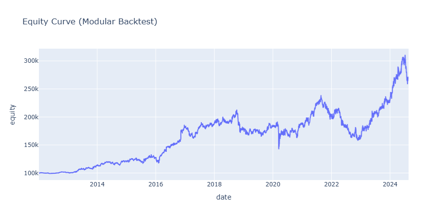

# Pairs Trading Strategy — NSGA-II & Random Forest (ML_PT_strategy.ipynb)

An end-to-end algorithmic pairs trading strategy combining multi-objective evolutionary optimization and machine learning, backtested on S&P 500 constituents over 12 years (2012–2024).

> **Inspired by:** Figueira, M., & Horta, N. (2022). _Machine learning-based pairs trading strategy with multivariate signals._ SSRN 4295303. This project extends their framework by introducing NSGA-II for multi-objective pair selection, dynamic position sizing conditioned on model confidence, and a macro regime filter based on the 10Y Treasury rate.

---

## Performance Summary (2012–2024)

| Metric             | Value                            |
| ------------------ | -------------------------------- |
| Total Return       | +169.65%                         |
| CAGR               | 8.19%                            |
| Annualized Alpha   | **7.86%**                        |
| Beta (vs SPY)      | **0.077** — quasi market-neutral |
| Sharpe Ratio       | 0.60                             |
| Sortino Ratio      | 0.80                             |
| Calmar Ratio       | 5.06                             |
| Max Drawdown       | −33.54%                          |
| Trade Win Rate     | 49.64%                           |
| Avg Holding Period | 50 days                          |
| Closed Trades      | 3,795                            |



> The near-zero beta (0.077) confirms the strategy's market-neutral nature across a 12-year period covering the 2015 correction, the 2020 COVID crash, and the 2022 rate-hiking cycle.

---

## Table of Contents

1. [Data & Universe](#1-data--universe)
2. [Pair Selection with NSGA-II](#2-pair-selection-with-nsga-ii)
3. [Cointegration & Half-Life](#3-cointegration--half-life)
4. [ML Signal Generation](#4-ml-signal-generation)
5. [Backtesting & Risk Management](#5-backtesting--risk-management)

---

## 1. Data & Universe

**Universe:** S&P 500 constituents, filtered by sector (GICS classification) to restrict pair candidates to economically related equities.

To eliminate look-ahead bias, the timeline is split into two strictly non-overlapping rolling windows:

| Window         | Length             | Purpose                                              |
| -------------- | ------------------ | ---------------------------------------------------- |
| Formation      | 1,000 trading days | Pair selection, parameter estimation, model training |
| Trading / Test | 200 trading days   | Out-of-sample signal generation and execution        |

### Feature Engineering

All features are computed on the **static spread** only (beta fixed at formation end — no rolling recalibration that would introduce forward-looking information):

| Feature                    | Description                                            |
| -------------------------- | ------------------------------------------------------ |
| Z-Score                    | Spread normalized by formation-period mean and std     |
| RSI (14d)                  | Relative Strength Index of the spread                  |
| MACD (12/26d)              | Momentum of the spread                                 |
| SMA (5, 10, 20d)           | Short-term trend of the spread                         |
| Rolling Correlation (30d)  | Pair relationship stability check                      |
| Realized Volatility (10d)  | Rolling std of the spread                              |
| Volume Ratio (5d smoothed) | Asset 1 / Asset 2 volume, filters liquidity imbalances |
| Spread Beta vs SPY (20d)   | Market decoupling of the spread                        |
| TNX Level                  | 10Y Treasury rate — macro regime indicator             |

Features are standardized (StandardScaler) then reduced via **PCA retaining 95% of variance** (typically 8–12 components).

---

## 2. Pair Selection with NSGA-II

### Motivation

Classical approaches (OPTICS, K-Means clustering) group assets without optimizing for tradability. Instead, NSGA-II searches the **Pareto frontier** of pair quality across three conflicting objectives — no arbitrary weighting required.

### Objective Functions (all minimized)

| Objective                       | Description                                                                       |
| ------------------------------- | --------------------------------------------------------------------------------- |
| F₁ — Cointegration p-value      | Minimize p-value → maximize statistical significance of the long-run relationship |
| F₂ — Negative spread volatility | Minimize −volatility → maximize tradable amplitude                                |
| F₃ — Half-life                  | Minimize HL → favor fast-converging spreads                                       |

### Algorithm Parameters

```
Population size : 50
Generations     : 80
Crossover       : SBX, prob=0.9 (integer-adapted with RoundingRepair)
Mutation        : PM,  prob=0.1 (integer-adapted with RoundingRepair)
```

### Post-Pareto Filtering (strict)

After the Pareto front is identified, a hard filter is applied — approximately **80% of Pareto-optimal pairs are rejected**:

- Hedge ratio β > 0 (no spurious inverse relationships)
- ADF p-value < 0.10 (spread stationarity confirmed)
- Half-life < 20 days (convergence fast enough to be practically tradable)

---

## 3. Cointegration & Half-Life

The mean-reversion dynamic is modeled as an **Ornstein-Uhlenbeck process**, estimated via an AR(1) regression on spread differences:

$$\Delta S(t) = \alpha + \lambda \cdot S(t-1) + \epsilon(t)$$

$$\text{Half-Life} = \frac{-\ln(2)}{\lambda}$$

A half-life of 20 days means the spread is expected to close at least half its deviation within 20 days — this directly informs the maximum holding period (`max_holding_days = 2.5 × HL`).

---

## 4. ML Signal Generation

### Random Forest Classifier

| Parameter            | Value        | Rationale                                                   |
| -------------------- | ------------ | ----------------------------------------------------------- |
| `n_estimators`       | 50           | Intentionally limited to reduce overfitting                 |
| `max_depth`          | 4            | Shallow trees generalize better on financial noise          |
| `min_samples_leaf`   | 5            | Prevents fitting on micro-patterns                          |
| Retraining frequency | Every 5 days | Rolling walk-forward — no future data ever used in training |
| Target horizon H     | 10 days      | Binary: 1 if spread reverts within H days, 0 otherwise      |

The model outputs `prob_revert` — the estimated probability of mean-reversion within the next 10 days.

### Decision Logic

| Condition                                            | Signal                                              |
| ---------------------------------------------------- | --------------------------------------------------- |
| Z-score < −1.5 **and** prob_revert > 0.65            | **LONG** the spread                                 |
| Z-score > +1.5 **and** prob_revert > 0.65            | **SHORT** the spread                                |
| \|Z-score\| < 0.5                                    | **FLAT** — take profit                              |
| Position open, \|Z-score\| < 1.2, prob_revert < 0.45 | **Early exit** — cut before full reversion fails    |
| Rolling correlation (30d) < 0.20                     | **FLAT** — relationship breakdown, exit immediately |

---

## 5. Backtesting & Risk Management

### Position Sizing

| Condition                                         | Allocation                                                                           |
| ------------------------------------------------- | ------------------------------------------------------------------------------------ |
| Standard signal                                   | 9% of capital per pair                                                               |
| High conviction (\|Z\| > 2.5 **and** corr > 0.70) | Up to 30% of capital (we could decrease this value if we want a less risky strategy) |

### Exit Rules & Transaction Costs

| Rule                  | Trigger                                           |
| --------------------- | ------------------------------------------------- |
| Stop-Loss             | Unrealized P&L < −15% of notional                 |
| Time Stop             | Holding period > 2.5 × Half-Life                  |
| Correlation breakdown | Rolling 30d correlation < 0.20                    |
| Circuit Breaker       | Portfolio-level drawdown > 50% → full liquidation |
| Transaction costs     | 2 bps fee + 2 bps slippage = 4 bps per trade      |

### Exit Reason Breakdown (2012–2024)

| Exit Reason        | Count | Avg P&L | Total P&L     |
| ------------------ | ----- | ------- | ------------- |
| time_stop          | 3,325 | +€151   | **+€501,698** |
| signal_to_flat     | 292   | +€344   | **+€100,383** |
| end_of_backtest    | 74    | +€120   | +€8,861       |
| loss_stop          | 97    | −€4,380 | **−€424,884** |
| time_and_loss_stop | 6     | −€2,845 | −€17,071      |

> The loss_stop category (97 trades, 2.6% of all trades) accounts for the majority of P&L destruction. The gross P&L from all other exits exceeds +€610k — the primary area for further improvement is tightening the stop-loss relative to position size.
